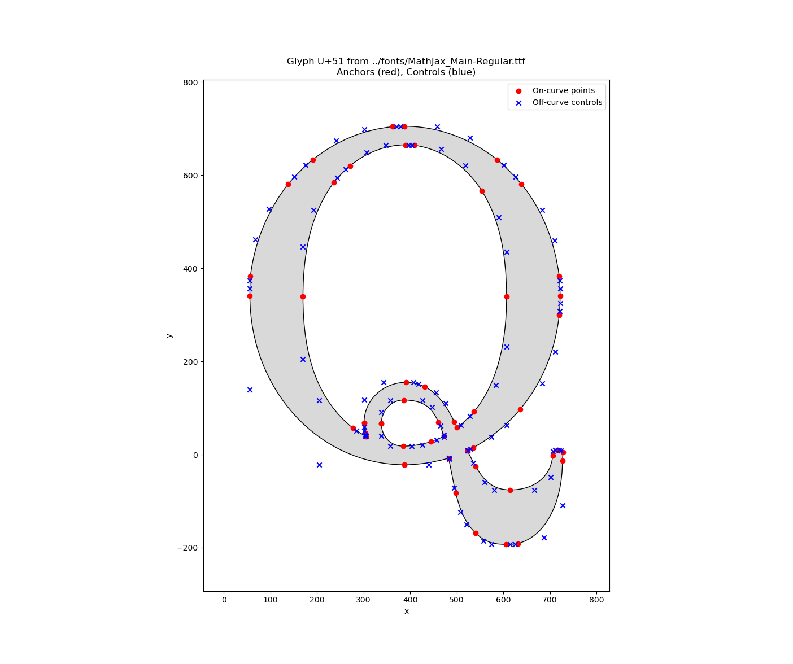
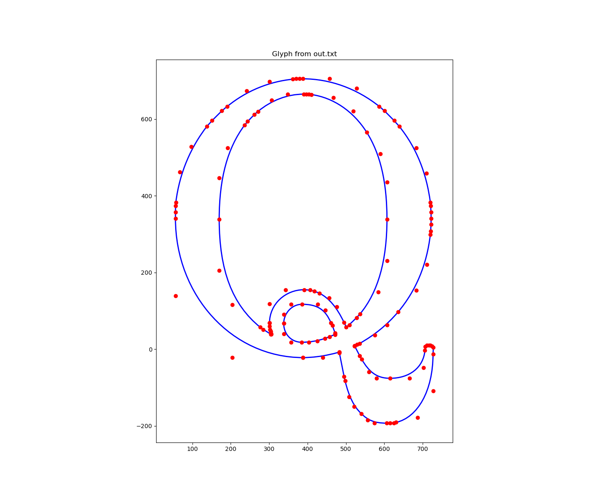
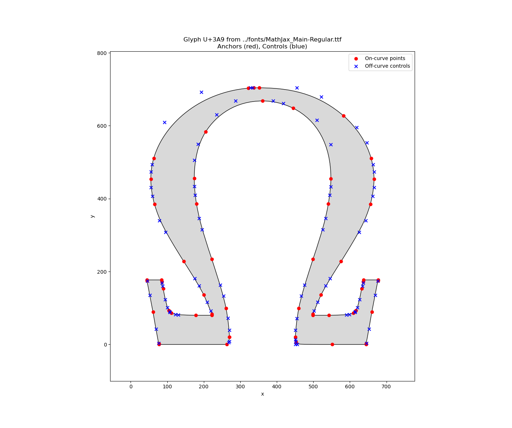
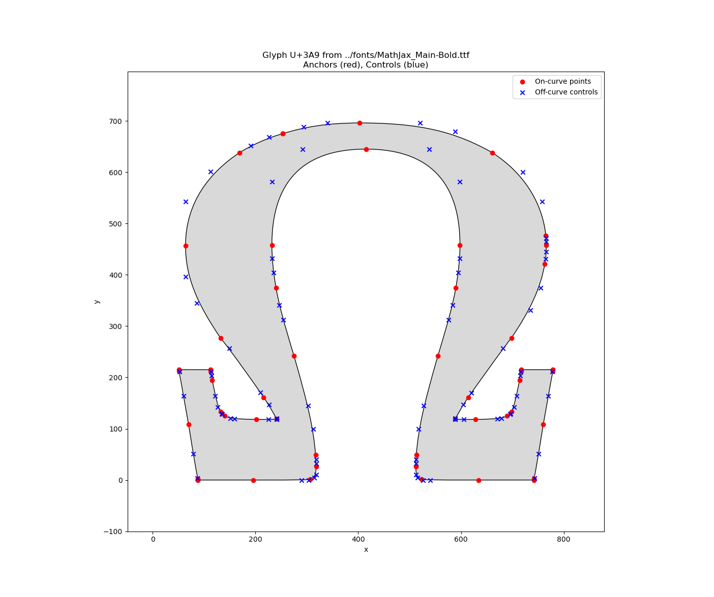
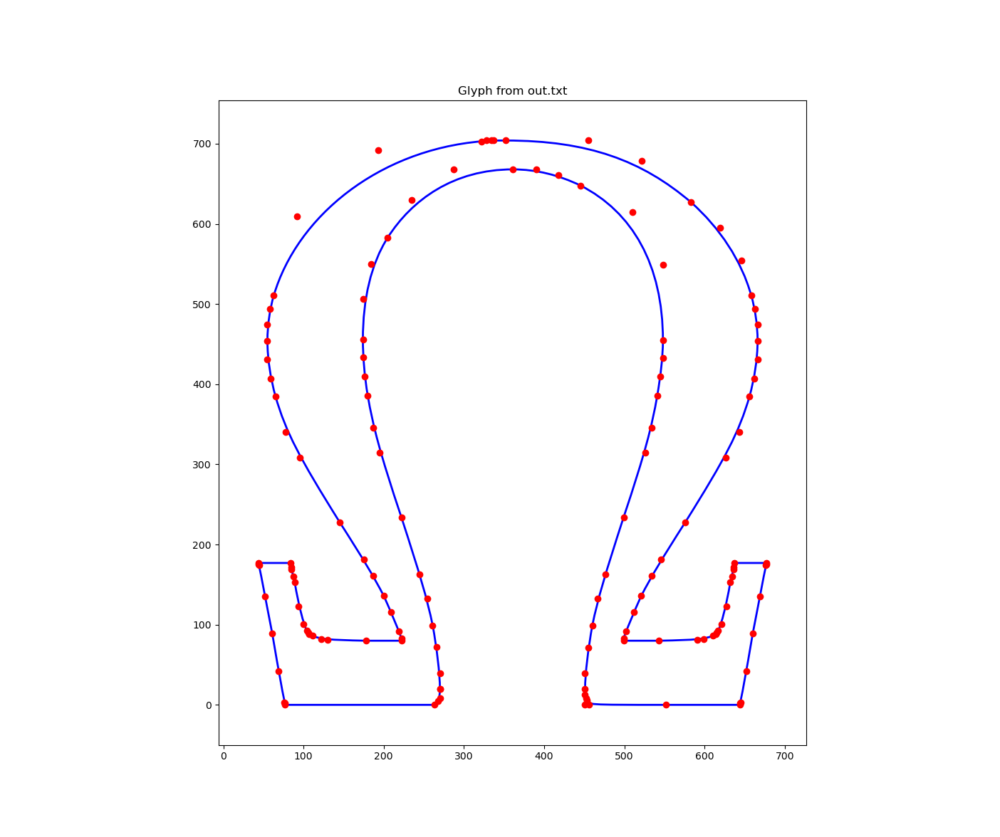
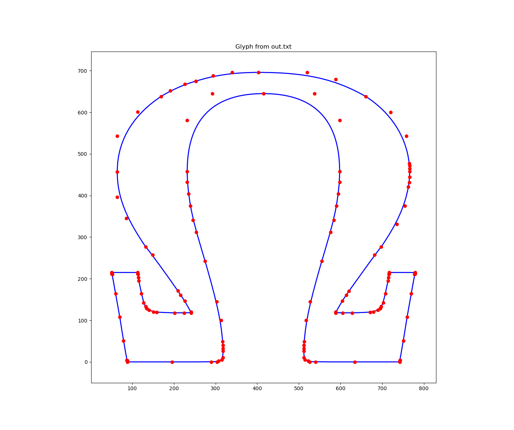

# how does it work?

## step 1
run the included `woff2otf.py` script to convert your `.woff` font file into `.otf` if it isn't already.

```
./woff2otf.py MathJax_Calligraphic-Regular.woff MathJax_Calligraphic-Regular.otf
```

## step 1.5

if you already know the unicode character you want, in this case we want `U+0041` then you can skip this step.

install the font on your computer by double clicking the `.otf` file. navigate to the character you want and copy it's unicode value.

## step 2

run the `splines.py` file to check your visualisation, it will ask you for the file you wish to rip the glyph from as `argparse` arguments, as well as the unicode value of the glyph itself that you desire.

from within the `src` directory: 
```
python splines.py --font "../fonts/MathJax_Main-Regular.ttf" --unicode 0051
```

## step 2.5

you can save the outputted figure as a `.png`. 

close the window when you are done inspecting it's output --- a text file named `out.txt` will appear after closing the preview.

## step 3

run `redraw.py` to rebuild the glyph exclusively using the spline coordinates that you ripped from the font file. the coordinates along with some analysis is present in the `out.txt` file.









